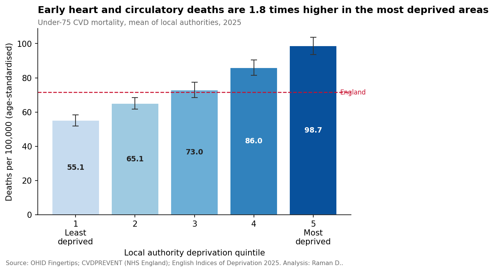
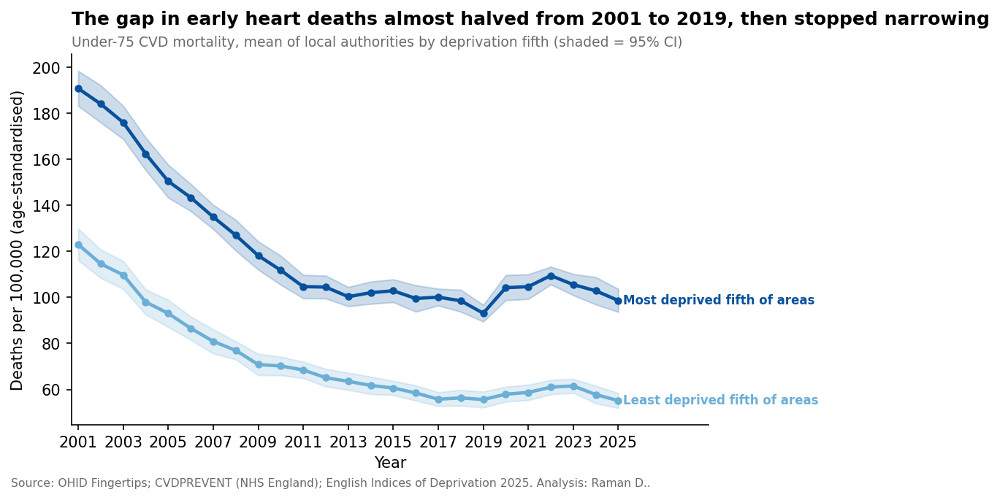
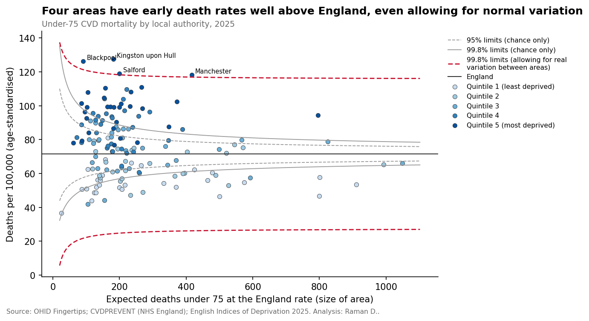
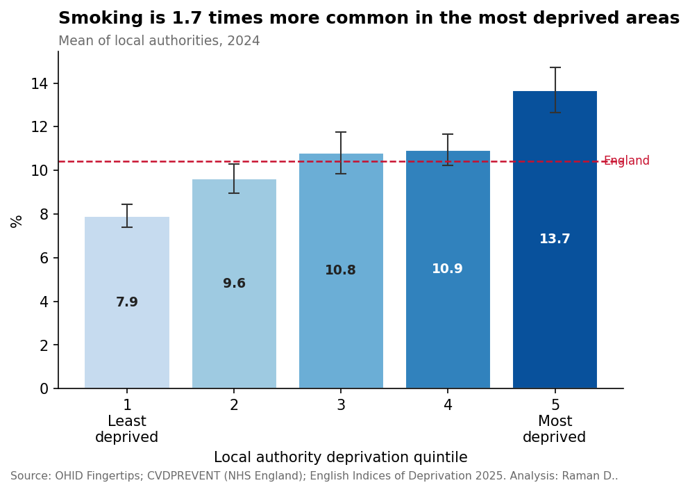
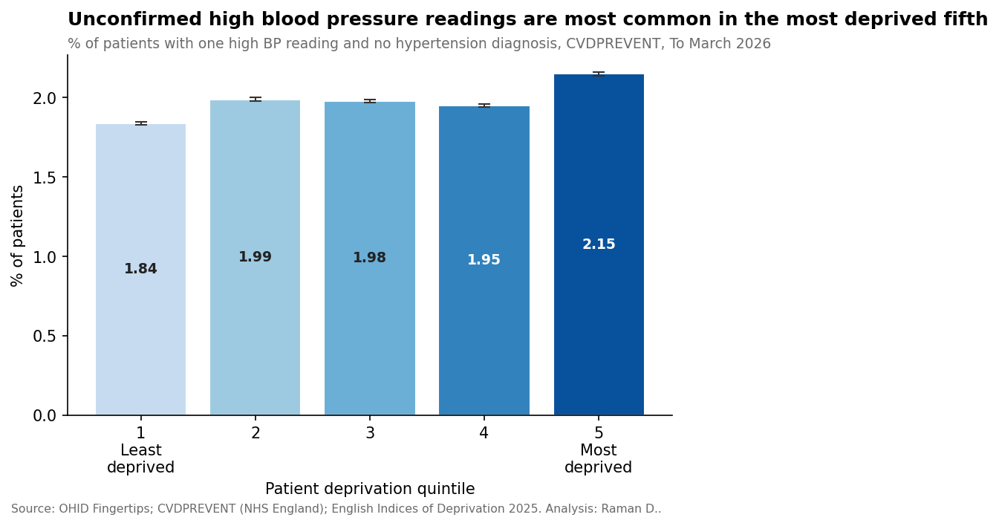
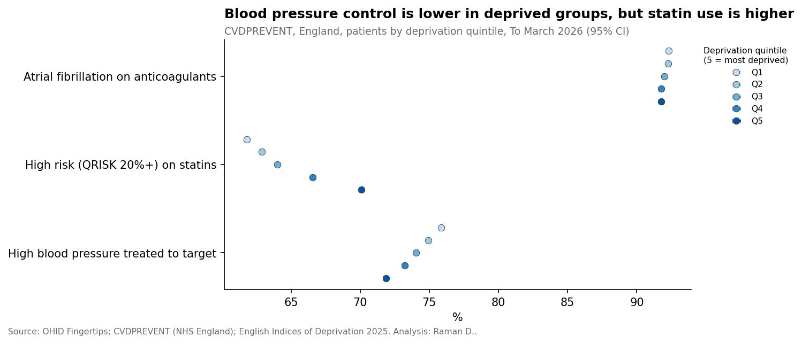

# Hidden Risk
## Where you live and your chances of dying early from heart and circulatory disease in England

*Raman D. | October 2026 | Data: OHID Fingertips, CVDPREVENT (NHS England), English Indices of Deprivation 2025*

---

### Key points

- People living in England's most deprived areas are **almost twice as likely** to die from heart and circulatory disease before the age of 75 as people in the least deprived areas.
- Between 2001 and 2019, this gap **almost halved**. Since 2019, it has **stopped closing**.
- In the most deprived fifth of the population, people with diagnosed high blood pressure are less likely to have it under control. If they did as well as the least deprived fifth, around **71,000 more people** would have their blood pressure at a safe level.
- Some prevention is reaching deprived communities: people at high risk of a heart attack or stroke are **more likely** to be on cholesterol-lowering medicine in the most deprived areas than in the least deprived.
- **Eleven areas**, nine of them among the most deprived in England, combine high rates of smoking and excess weight with high early death rates. These may be where prevention could make the biggest difference.

---

### 1. Early deaths: a gap that has stopped closing

In 2025, about 72 in every 100,000 people under 75 in England died from heart and circulatory disease. But this average hides big differences.

In the least deprived fifth of local areas, the rate was 55 per 100,000. In the most deprived fifth, it was 99 per 100,000, almost twice as high.

There is good news in the long run. Since 2001, early death rates have fallen sharply everywhere, and the gap between the most and least deprived areas almost halved by 2019. But after 2019, death rates rose again during and after the COVID-19 pandemic, especially in the most deprived areas. By 2025, rates had started to fall again, but the gap was still no smaller than it was in 2019.

*The shaded bands show the range in which the true value is likely to lie.*

### 2. Which areas stand out?

Some differences between areas are down to chance, especially in smaller places. To find areas that are genuinely unusual, we used a "funnel plot", which compares each area with what we would expect given its size.

Four areas have early death rates well above England's, even after allowing for the normal variation between places: **Kingston upon Hull, Blackpool, Salford and Manchester**. All four are among the most deprived areas in England, and in each, early death rates are around 1.6 to 1.8 times the national average.

### 3. Smoking and weight

Smoking is one of the biggest causes of heart and circulatory disease. In the most deprived areas, about 14 in every 100 adults smoke, compared with about 8 in 100 in the least deprived areas.

Excess weight is common everywhere. Around 6 in 10 adults are overweight or obese even in the least deprived areas, rising to nearly 7 in 10 in the most deprived.

### 4. High blood pressure: hidden and uncontrolled

High blood pressure rarely causes symptoms, so many people don't know they have it. It is estimated that around **4 million adults in England** had undiagnosed high blood pressure in 2021.

Where is it hidden? The answer depends on how you look:

- **Modelled estimates** put undiagnosed high blood pressure highest in places with older populations, such as Dorset, the Isle of Wight and Torbay. This is most likely because high blood pressure becomes much more common with age.
- **GP records** tell a different story. People with a high blood pressure reading but no diagnosis are most common in the most deprived fifth of the population.

Once people are diagnosed, getting their blood pressure under control matters. In the least deprived fifth of the population, 76 in 100 people with high blood pressure have it at a safe level. In the most deprived fifth, it's 72 in 100. That gap of 4 in 100 adds up to around **71,000 people**.

### 5. Signs that prevention is reaching people

Not every measure shows deprived communities doing worse. Among people at high risk of a heart attack or stroke, **70 in 100** in the most deprived fifth are taking cholesterol-lowering medicine such as statins, compared with **62 in 100** in the least deprived. Treatment for atrial fibrillation, an irregular heartbeat that raises the risk of stroke, is high and almost equal for everyone.

This shows that gaps in care are not inevitable.

### 6. Where prevention could make the biggest difference

We looked for areas that rank in the worst fifth of England for **both** smoking and excess weight **and** early deaths. Eleven areas meet both conditions:

**Kingston upon Hull, Blackpool, Barking and Dagenham, Sandwell, Tameside, Doncaster, Nottingham, Stoke-on-Trent, Middlesbrough, South Tyneside and Calderdale.**

Nine of the eleven are in the most deprived fifth of areas in England. In these places, helping people stop smoking, supporting healthy weight, and finding and treating high blood pressure earlier could prevent many early deaths.

### What this means

Where you live should not decide how long you live. The progress made between 2001 and 2019 shows that the gap can be narrowed. Restarting that progress means focusing prevention where risk is highest, and making sure that everyone with high blood pressure is diagnosed and treated well.

**If you are over 40, know your numbers.** Get your blood pressure checked at your GP, a pharmacy or through an NHS Health Check.

---

### About this analysis

This analysis uses published statistics for 153 upper-tier local authorities in England, along with national GP-record data from the CVDPREVENT audit. It describes areas and groups, not individuals, and shows links rather than causes. Different measures cover different years (2021 to 2026).

Full methods, limitations and code: see the [technical explainer](02_technical_explainer.md) and the [project repository](../../README.md).

*Contains public sector information licensed under the Open Government Licence v3.0.*
